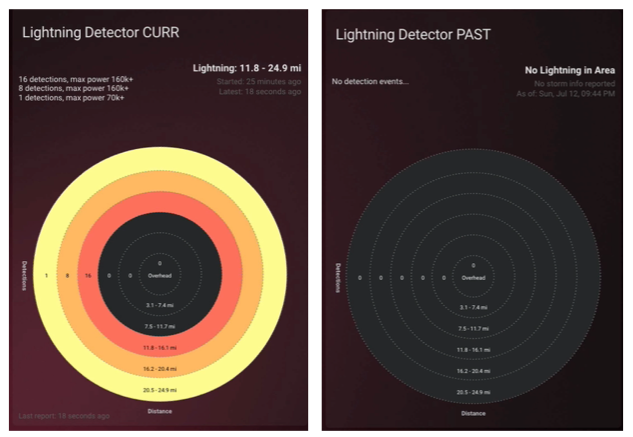

# Lovelace Lightning Detector Card

![Project Maintenance][maintenance-shield]

[![License][license-shield]](LICENSE)

[![GitHub Release][releases-shield]][releases]


I picked up an inexpensive lightning detector sensor based on the AS3925 integrated circuit on a small circuit board from [Sparkfun](https://www.sparkfun.com) (*where i spend too much money ;-)*) and attached it to one of my Raspberry Pi's that I had sitting around.  I then installed my software ([see my detector project](https://github.com/ironsheep/lightning-detector-MQTT2HA-Daemon)) to talk to the AS3935 on the RPi  and forward what it detected to my MQTT broker which was then forwarded onn to my Home Assistant installation.  This Lovelace Card project provides a means to display the lighting detector data in a much more easily interpreted form.

### Where to get the sensor board

Please visit my sensor project for detail on how/where to get the sensor and for the software needed to send the data to Home Assistant. [See my [lightning-detector-MQTT2HA-Daemon](https://github.com/ironsheep/lightning-detector-MQTT2HA-Daemon) project.]


## About this card

This is aLovelace card for depicting lightning in your local area as detected by your own inexpensive sensor. The card has range-rings that when colored indicate that lightning was detected at that range. There are additional details describing when the detections first started (Storm began) how frequent and how stong the detections are (relative power).



With this card you can see a storm approach and how strong it is. You'll also see when the last strike occurred.

Here are a couple videos showing the card in action:

- [Storm passing nearby](https://youtu.be/JqDANkaNPYQ) - youtube
- [Storm passing overhead](https://youtu.be/8p5WBOeDCfc) - youtube


## Support

You are certainly welcome to help me out for a couple of :coffee:'s or :pizza: slices!

[](https://www.buymeacoffee.com/ironsheep)


## Installation

Use [HACS](https://github.com/custom-components/hacs) (recommended)
or download *lightning-detector-card.js* from our [Latest Release](https://github.com/ironsheep/lovelace-lightning-detector-card/releases/latest) and place it in your www directory.

In your ui-lovelace.yaml (or resources.yaml, whichever you use for resources) add this:

```yaml
- url: /hacsfiles/lightning-detector-card/lightning-detector-card.js
  type: module
```

If you don't use HACS please change the url accordingly.

## Config

| Name             | Type   | Default       | Description                 |
| ---------------- | ------ | ------------- | --------------------------- |
| title            | string |  {sensor name}             | Common title                

### The sensor setting affecting this display

The Lightning MQTT Daemon sends some settings to this card. These settings are:


| Name             | Type   | Default       | Description                 |
| ---------------- | ------ | ------------- | --------------------------- |
| period\_in\_minutes        | number |  5   | display detections during this period.            
| number\_of\_rings          | number |  5   | number of rings [3-7]    
| distance\_as               | string |  km  | distance units [km, mi]     
| end\_storm\_after\_minutes | number |  30  | mark storm ended after no further detections during this end period.  

To change any of these you'll want to modify the *config.ini* for your sensor and restart it. This card will then automatically pick up the new values.                 

## Credits

- [iantrich](https://github.com/iantrich) for the card template and cards you've created which made my implementation effort much easier.
- [RomRider](https://github.com/RomRider) for color handling examples as well as other techniques I "borrowed".

## License

Copyright © 2020 Iron Sheep Productions, LLC. All rights reserved.<br />
Licensed under the MIT License. <br>
<br>
Follow these links for more information:

### [Copyright](copyright) | [License](LICENSE)

[maintenance-shield]: https://img.shields.io/badge/maintainer-S%20M%20Moraco%20%40ironsheepbiz-blue.svg?style=for-the-badge
[license-shield]: https://camo.githubusercontent.com/bc04f96d911ea5f6e3b00e44fc0731ea74c8e1e9/68747470733a2f2f696d672e736869656c64732e696f2f6769746875622f6c6963656e73652f69616e74726963682f746578742d646976696465722d726f772e7376673f7374796c653d666f722d7468652d6261646765
[releases-shield]: https://img.shields.io/github/release/ironsheep/lovelace-lightning-detector-card.svg?style=for-the-badge
[releases]: https://github.com/ironsheep/lovelace-lightning-detector-card/releases