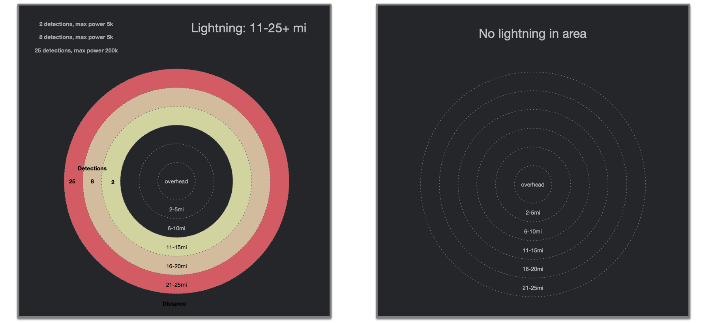
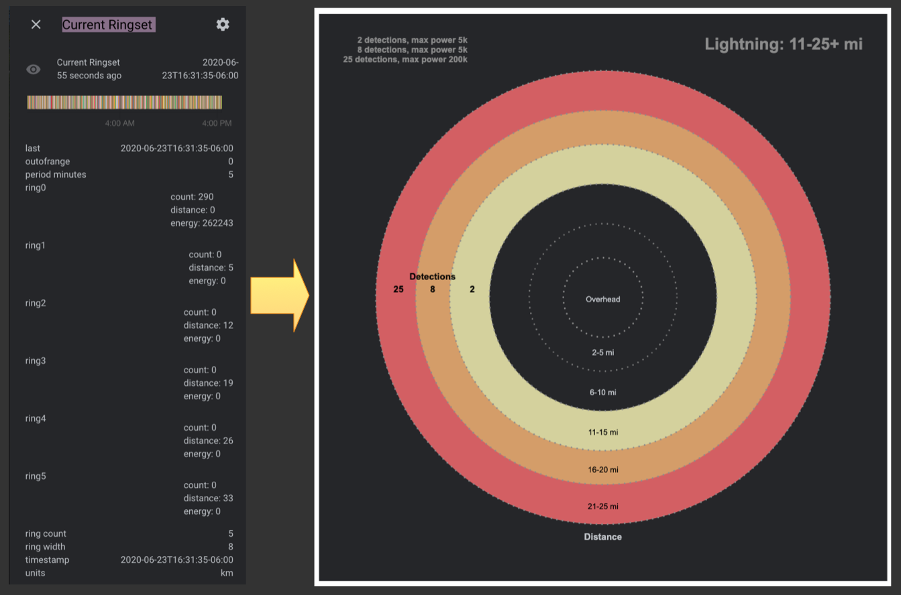

# Lovelace Lightning Detector Card

![Project Maintenance][maintenance-shield]

I picked up an inexpensive lightning detector sensor based on the AS3925 integrated circuit on a small circuit board from [Sparkfun](https://www.sparkfun.com) (*where i spend too much money ;-)*) and attached it to one of my Raspberry Pi's that I had sitting around.  I then installed my software ([see my detector project](https://github.com/ironsheep/lightning-detector-MQTT2HA-Daemon)) to talk to the AS3935 on the RPi  and forward what it detected to my MQTT broker which was then forwarded onn to my Home Assistant installation.  This Lovelace Card project provides a means to display the lighting detector data in a much more rapidly interpreted form.

### Where to get the sensor board

Please visit my sensor project for detail on how/where to get the sensor and for the software needed to send the data to Home Assistant. [See my [lightning-detector-MQTT2HA-Daemon](https://github.com/ironsheep/lightning-detector-MQTT2HA-Daemon) project.]


## About this card

We are working on a new Lovelace card for depicting lightning in your local area as detected by your own inexpensive sensor. Here are what the card will look like:



NOTE: this is our initial mockup but it is nearly identical to what is currently working in our test environment.

From another perspective, we are taking data shown below on the left as  Home Assistant sees it to make the display on the right:



_NOTE: the values on the left are not what are shown on the right (which is more interesting...) but you get the point, right?_

## Support

You are certainly welcome to help me out for a couple of :coffee:'s or :pizza: slices!

[](https://www.buymeacoffee.com/ironsheep)


---

-------------------- - - - - - - CAUTION -- CAUTION -- CAUTION

WHILE THIS CARD IS NOT YET READY FOR USE. The following is beginning to appear here as we are building the card for you.

Please be patient, this marker will be removed when the card is finally ready for use (_after we have a working version for you to use, of course._)

-------------------- - - - - - - CAUTION -- CAUTION -- CAUTION

---

## Installation

Use [HACS](https://github.com/custom-components/hacs) (recommended)
or download [lightning-detector-card.js](https://github.com/ironsheep/lovelace-lightning-detector-card/raw/master/lightning-detector-card.js) and place it in your www directory.

In your ui-lovelace.yaml (or resources.yaml, whichever you use for resources) add this:

```yaml
- url: /hacsfiles/lightning-detector-card/lightning-detector-card.js
  type: model
```

If you don't use HACS please change the url accordingly.

## Config

| Name             | Type   | Default       | Description                 |
| ---------------- | ------ | ------------- | --------------------------- |
| title            | string |               | Common title                |
| light_color      | string | yellow        | color override (optional)   |
| medium_color     | string | orange        | color override (optional)   |
| heavy_color      | string | red           | color override (optional)   |
| background_color | string | theme-default | background color (optional) |
| light_text_color | string | black         | color override (optional)   |
| dark_text_color  | string | light-grey    | color override (optional)   |

### The sensor setting affect this display

e.g., The number of rings is controlled by the _config.ini_ in your sensor setup files.

## Credits

- [iantrich](https://github.com/iantrich) for the card template and cards you've created which made my implementation effort much easier.
- [RomRider](https://github.com/RomRider) for color handling examples as well as other techniques I "borrowed".

## License

Copyright © 2020 Iron Sheep Productions, LLC. All rights reserved.<br />
Licensed under the MIT License. <br>
<br>
Follow these links for more information:

### [Copyright](copyright) | [License](LICENSE)

[maintenance-shield]: https://img.shields.io/badge/maintainer-S%20M%20Moraco%20%40ironsheepbiz-blue.svg?style=for-the-badge
